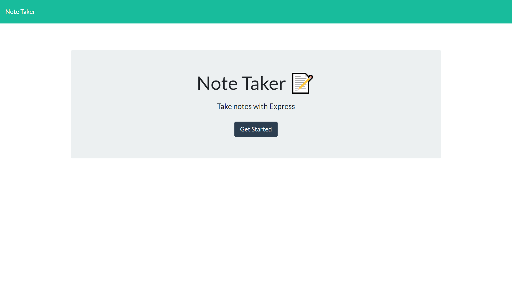
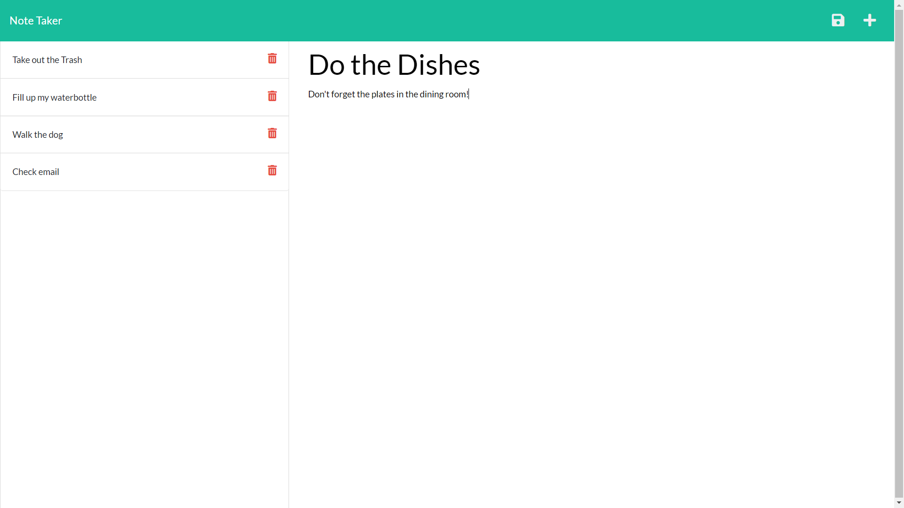

# Note Taker

## Description

A web application that can be used to write and save notes.

## Table of Contents

* [User Story](#user-story)
* [Installation](#installation)
* [Screenshot](#screenshot)
* [License](#license)
* [Questions](#questions)

## User Story

AS A small business owner  
I WANT to be able to write and save notes  
SO THAT I can organize my thoughts and keep track of tasks I need to complete

## Installation

No installation required! Navigate to https://polar-inlet-91104.herokuapp.com/

## Screenshot

## License

Distributed under the [Unlicense](https://choosealicense.com/licenses/unlicense/).

## Questions

* GitHub Profile: [JPDBrodeur](https://github.com/JPDBrodeur)

* Have any additional questions? You can reach me by email at [jbrodeur001@gmail.com](mailto:jbrodeur001@gmail.com).